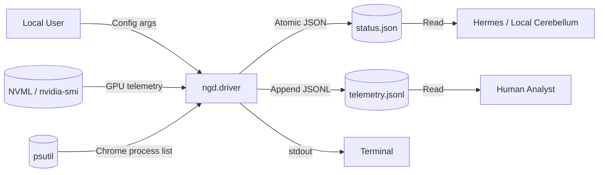

# Threat Model: NVIDIA Gratitude Driver

## Overview

**System**: NVIDIA Gratitude Driver (ngd)
**Type**: User-mode GPU telemetry collector and edge-cloud routing advisor
**Trust Boundary**: Local user session; no network egress; no cross-process memory access

---

## Data Flow Diagram

---

## STRIDE Analysis

### S — Spoofing
| ID | Threat | Likelihood | Impact | Mitigation |
|----|--------|------------|--------|------------|
| S-1 | Malicious `nvidia-smi` output injection | Low | Low | Driver uses NVML primary; `nvidia-smi` fallback parses CSV strictly; timeout=3s |
| S-2 | Fake Chrome process entries via `psutil` | Low | Low | Only reads process metadata (name, cmdline, memory_info); no exec |
| S-3 | Impersonation of driver by another process | Very Low | Low | No IPC surface; files written to user-owned runtime dir |

### T — Tampering
| ID | Threat | Likelihood | Impact | Mitigation |
|----|--------|------------|--------|------------|
| T-1 | Status file corruption / race | Low | Medium | Atomic write via `.tmp` + `rename`; single-writer |
| T-2 | Telemetry log injection | Low | Low | Append-only JSONL; log rotation bounds size |
| T-3 | Config tampering via argv/env | Low | Medium | No config file; all params via CLI args validated by `argparse` |
| T-4 | NVML shared library hijack | Very Low | High | Loads `pynvml` from venv; Windows DLL search order safe in venv |

### R — Repudiation
| ID | Threat | Likelihood | Impact | Mitigation |
|----|--------|------------|--------|------------|
| R-1 | Operator denies route decision | Low | Low | Timestamped JSONL log; `sha256` prompt hashes in governor cache |
| R-2 | Telemetry gap claims | Low | Low | Continuous EWMA samples; rotation preserves last N MB |

### I — Information Disclosure
| ID | Threat | Likelihood | Impact | Mitigation |
|----|--------|------------|--------|------------|
| I-1 | GPU telemetry reveals workload patterns | Medium | Low | Local-only; no network egress; user controls retention |
| I-2 | Chrome process list reveals browsing activity | Low | Low | Only aggregate counts + working set; no URLs, titles, cookies |
| I-3 | Prompt hashes in governor cache | Low | Low | SHA-256 truncated to 16 chars; no prompt text stored |
| I-4 | Log file permissions | Low | Medium | Written to user directory; default umask applies |

### D — Denial of Service
| ID | Threat | Likelihood | Impact | Mitigation |
|----|--------|------------|--------|------------|
| D-1 | Disk fill via telemetry log | Low | Medium | `--max-log-mb` rotation (default 10 MB); atomic rotate to `.1` |
| D-2 | `nvidia-smi` hang blocks sampling | Low | Medium | `subprocess.run(timeout=3)`; NVML preferred |
| D-3 | EWMA / router flapping | Low | Medium | Hysteresis with cooldown (default 90s); alpha=0.22 |
| D-4 | Signal handler reentrancy | Very Low | Low | Single boolean flag; no async logic in handler |

### E — Elevation of Privilege
| ID | Threat | Likelihood | Impact | Mitigation |
|----|--------|------------|--------|------------|
| E-1 | Driver runs with elevated perms | None | N/A | No `sudo`, no `setuid`, no capabilities, no admin required |
| E-2 | Vulnerability in `nvidia-ml-py` / `psutil` | Low | High | `pip-audit` in CI; dependencies pinned; min versions enforced |
| E-3 | Path traversal in runtime dir | Low | Medium | `Path(args.runtime).resolve()`; output constrained to subdir |

---

## Attack Surface Inventory

| Interface | Protocol | AuthN | AuthZ | Encryption | Notes |
|-----------|----------|-------|-------|------------|-------|
| CLI argv | Process spawn | OS user | OS user | N/A | Validated by `argparse` |
| NVML | C API via `pynvml` | GPU driver | GPU driver | N/A | Local only |
| `nvidia-smi` | Subprocess | OS user | OS user | N/A | `timeout=3`, no shell |
| psutil | `/proc` / WMI | OS user | OS user | N/A | Read-only process enum |
| File: status.json | Local FS | OS user | OS user | N/A | Atomic write |
| File: telemetry.jsonl | Local FS | OS user | OS user | N/A | Append-only, rotated |
| File: prompt_hash_cache.json | Local FS | OS user | OS user | N/A | Atomic write |
| Stdout | Terminal | OS user | OS user | N/A | JSON lines |

---

## Security Controls Summary

| Control | Implementation |
|---------|----------------|
| **Least Privilege** | Runs as standard user; no admin, no capabilities |
| **Input Validation** | `argparse` type checks; regex bounded parsing; CSV strict parse |
| **Output Encoding** | JSON serialization via `json.dumps`; no templating |
| **Atomic Writes** | `.tmp` + `os.replace()` for all state files |
| **Resource Limits** | Log rotation at `--max-log-mb`; subprocess timeout 3s |
| **Dependency Scanning** | `pip-audit` in CI on every push/PR |
| **SBOM** | `cyclonedx-py` at release; uploaded as artifact |
| **Provenance** | `cosign` signs wheel/sdist; attestations to GitHub Releases |
| **No Secrets** | Verified: no API keys, tokens, passwords in codebase |

---

## Residual Risk Acceptance

| Risk | Rationale |
|------|-----------|
| GPU telemetry side-channel | Local user already has this via `nvidia-smi`; no new exposure |
| Chrome process enumeration | Aggregate only; lower resolution than OS task manager |
| Prompt hash cache timing | Truncated SHA-256; no plaintext; cache local to user |

---

## Review History

| Date | Reviewer | Changes |
|------|----------|---------|
| 2026-06-05 | Auto-generated | Initial STRIDE model |